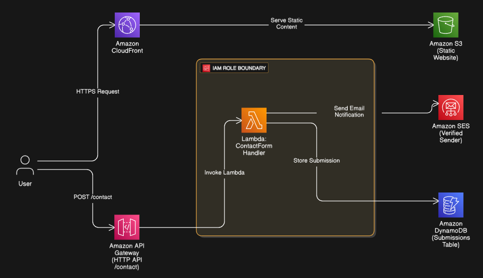

# 📬 Serverless Contact Form using AWS  
[](https://github.com/BHARATSURYA1128)


I created a fully-functional, scalable, and cost-effective **serverless contact form** and integrated it into my personal static website hosted on **Amazon S3 + CloudFront**. This contact form captures user input (Name, Email, Message), stores it securely in **DynamoDB**, and sends a formatted notification email directly to my inbox using **Amazon SES**. The entire communication and logic flow is handled through **API Gateway** and **AWS Lambda** — all configured by me under the AWS Free Tier.

---

## 🏗️ Architecture Overview

I designed the system architecture as follows:

```
[HTML Form]
   ↓
[API Gateway (POST /contact)]
   ↓
[AWS Lambda Function]
   ├──> [Amazon SES - Sends Email]
   └──> [Amazon DynamoDB - Stores Data]
```



> This is a completely serverless, cost-efficient, and globally available solution.

---

## ☁️ AWS Services I Used

| Service              | My Configuration & Usage                                |
|----------------------|----------------------------------------------------------|
| **Amazon S3**         | I hosted my static portfolio website files (HTML/CSS/JS) |
| **Amazon CloudFront** | I configured it to deliver the website globally and securely over HTTPS |
| **Amazon API Gateway**| I created a RESTful POST endpoint to accept form data   |
| **AWS Lambda**        | I wrote a function in Node.js to handle form logic      |
| **Amazon SES**        | I configured it to send an email with the form submission |
| **Amazon DynamoDB**   | I created a table to store form submissions             |
| **IAM Roles**         | I assigned permissions between Lambda, SES, and DynamoDB |

---

## 📩 Contact Form Flow (Step-by-Step)

1. A user visits my website and fills out the contact form.
2. When submitted, the form sends a POST request to the **API Gateway** endpoint.
3. The **Lambda function** I wrote does two things:
   - Sends an email via **Amazon SES** to notify me.
   - Stores the same data into **DynamoDB** for record-keeping.
4. **CloudFront** ensures fast and secure website delivery across regions.

---

## 🖼️ Screenshots

- **Final output**
- 

- 
- **S3 + CloudFront Setup**
- 

- 
- **API Gateway Route (POST /contact)**
- 
  [api route image](api.png)
- 
- **Lambda Function Configuration**
- 
  [lambda image](lambda.png)
-   
- **Amazon SES Sending Confirmation**
- 

-   
- **DynamoDB Table Records**
- 

- 

---

## 🚀 How I Deployed It

### ✅ 1. Hosted Static Website
- I uploaded my HTML files to an S3 bucket.
- Enabled static website hosting and made it public.
- Then, I connected it to CloudFront for secure HTTPS delivery.

### ✅ 2. Set Up API Gateway
- I created an HTTP API.
- Added a `POST /contact` route to receive form data.
- Integrated it with the Lambda function I wrote.

### ✅ 3. Developed Lambda Function
- Wrote a Node.js function that:
  - Parses request body
  - Sends the form input to my verified email via **Amazon SES**
  - Saves it into **DynamoDB** with a unique ID and timestamp

### ✅ 4. Configured SES (Amazon Simple Email Service)
- I verified my sender email.
- Initially worked in Sandbox mode; later I applied for production access.

### ✅ 5. Created DynamoDB Table
- Table name: `ContactMessages`
- Partition key: `id` (UUID)
- Additional attribute: `timestamp`

### ✅ 6. IAM Role Configuration
- Created and attached a custom execution role to Lambda:
  - `ses:SendEmail`
  - `dynamodb:PutItem`

### ✅ 7. Testing
- I deployed the site, tested the contact form, and validated:
  - Email arrives in inbox
  - Records are visible in DynamoDB
  - No CORS or permission issues

---

## ⚔️ Challenges I Solved

- CORS configuration in API Gateway for cross-origin form submission
- Debugging Lambda timeout and policy issues
- SES Sandbox restrictions (solved with production access)
- IAM permissions setup for least-privilege access

---

## 🧠 What I Learned

- Building real-world **serverless web apps** using AWS
- Practical use of **API Gateway, Lambda, SES, DynamoDB**
- Cloud security via IAM roles and policies
- Hosting and delivering static websites with **S3 + CloudFront**

---

## ✅ Final Outcome

This was an excellent real-world project that taught me how to integrate form data with backend cloud services without using a traditional server. The solution is completely serverless, low-latency, and ideal for personal portfolios or businesses.

---

## 🔮 Future Improvements

- Add **Google reCAPTCHA v3** to stop bots
- Validate inputs and sanitize data in Lambda
- Add **SNS** integration for SMS/Slack alerts
- Enable **JWT or API Key** protection for secure endpoints

---

> 🚀 Built with 💻 and ☁️ by **Surya**  
> 📅 Project Completed: **July 2025**
